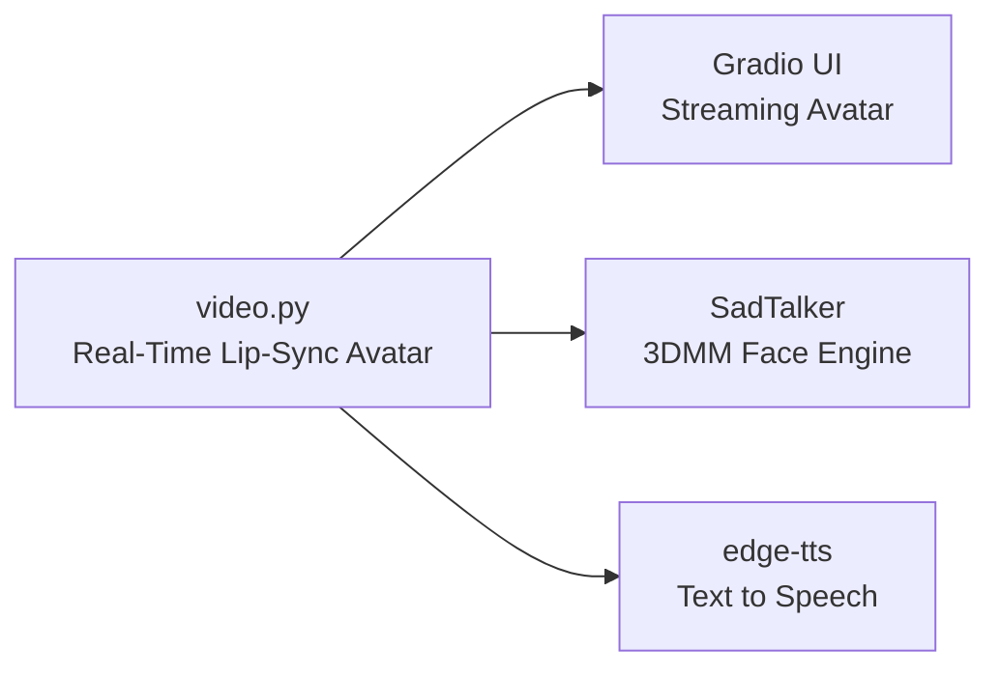
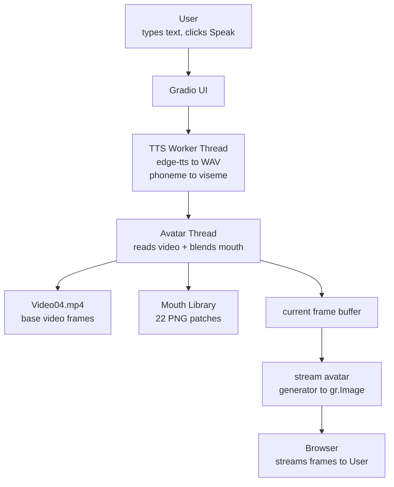
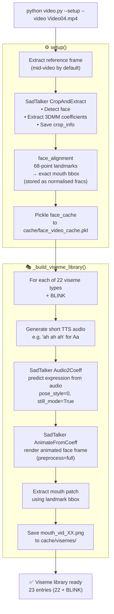
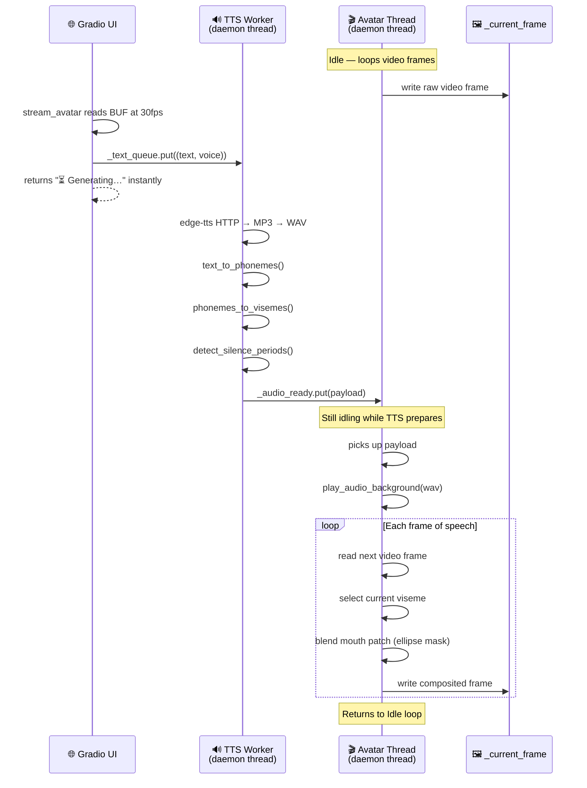
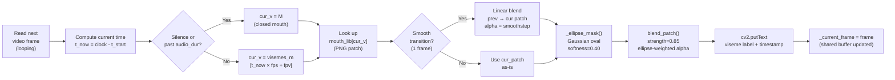
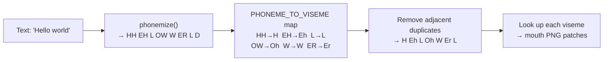

# video.py — Real-Time Lip-Sync Avatar System



> **Purpose:** Overlay animated mouth visemes onto a looping background video in real-time, driven by text-to-speech. Displays as a persistent avatar stream inside a Gradio web interface.

---

## 1. High-Level System Overview




---

## 2. One-Time Setup Pipeline (`--setup`)



### Cache Files Produced

| File | Contents |
|---|---|
| `cache/Video04_ref_frame.png` | Reference frame image |
| `cache/face_video_cache.pkl` | Face bbox, crop_info, coeff paths, **mouth_lm_frac** |
| `cache/visemes/mouth_vid_Aa.png` | Mouth patch for open-A sound |
| `cache/visemes/mouth_vid_M.png` | Mouth patch for closed/M sound |
| … 20 more | One PNG per viseme |

---

## 3. Runtime Threading Model



---

## 4. Viseme Blending Pipeline (per frame)



---

## 5. Phoneme → Viseme Mapping



**Full viseme inventory (22 types):**

| Viseme | Example Sounds | Example Words |
|---|---|---|
| `M` | M, B, P | *mom, baby* |
| `Aa` | AA | *father, hot* |
| `Ax` | AH | *about, banana* |
| `Ao` | AW, AO | *law, caught* |
| `Eh` | EH, AE | *bed, cat* |
| `Er` | ER | *her, bird* |
| `Iy` | IY | *see, feet* |
| `Ih` | IH | *sit, bit* |
| `W` | W, UW | *we, food* |
| `Oh` | OW | *go, home* |
| `Oy` | OY | *boy, toy* |
| `Ay` | AY | *my, eye* |
| `H` | HH | *he, hat* |
| `R` | R | *red, run* |
| `L` | L | *let, all* |
| `S` | S, Z | *see, zoo* |
| `Sh` | SH, ZH | *she, measure* |
| `Th` | TH, DH | *think, the* |
| `F` | F, V | *fee, van* |
| `T` | T, D, N | *ten, den* |
| `K` | K, G, NG | *cat, go* |
| `Sil` | silence/SP | pauses |

---

## 6. Gradio UI Layout

```
┌─────────────────────────────────────────────────────────┐
│  🎭 Live Avatar Lip-Sync                                │
│  "The avatar idles continuously. Type text and Speak."  │
├──────────────────────┬──────────────────────────────────┤
│                      │  💬 Text                         │
│   gr.Image           │  ┌────────────────────────────┐  │
│   (streaming=True)   │  │ Enter text to speak...     │  │
│                      │  └────────────────────────────┘  │
│   Avatar video loop  │  🎙️ Voice                        │
│   480px height       │  [en-US-JennyNeural ▼]           │
│                      │                                  │
│   "Listening…"       │  [🔊 Speak]   Status: ⏳...      │
│   label overlaid     │                                  │
│                      │  ▶ Setup (collapsed accordion)   │
└──────────────────────┴──────────────────────────────────┘
```

---

## 7. Feature Status

### ✅ Implemented

| Feature | How |
|---|---|
| Persistent idle video loop | OpenCV VideoCapture, frame-by-frame, auto-rewind |
| Non-blocking TTS | Dedicated daemon thread, `_text_queue` → `_audio_ready` |
| Phoneme extraction | `phonemizer` (espeak backend), rules-based fallback |
| 22-viseme mouth library | Pre-generated by SadTalker per video, cached as PNGs |
| Precise mouth placement | 68-point `face_alignment` landmarks → normalised bbox |
| Elliptical blend mask | Smoothstep oval, softness 0.40, no hard edges |
| Silence detection | `pydub` dBFS threshold → returns to M viseme |
| Audio playback | `pygame` mixer background, `ffplay` fallback |
| Gradio streaming | `gr.Image(streaming=True)` + generator at 30fps |
| Queue flush | Stale speech payloads discarded if new one arrives |

### ❌ Not Implemented (provided by video naturally)

| Feature | Notes |
|---|---|
| Head nods / sway | Source video provides this |
| Eye blinks | Source video provides this |
| Facial expressions | Source video provides this |
| Gaze direction | Source video provides this |

### 🚫 Out of Scope (future additions)

| Feature | Notes |
|---|---|
| LLM / chat responses | Would add LLM call before TTS |
| Microphone / ASR | Would pipe Whisper → text → TTS |
| Multiple speakers | Single avatar design |
| Video generation mode | Separate workflow via `inference.py` |

---

## 8. Configuration Reference

### CLI Arguments

| Argument | Default | Description |
|---|---|---|
| `--video` | `Video04.mp4` | Base video file |
| `--text` | *"Hello, this is…"* | Text to speak (CLI mode) |
| `--voice` | `en-US-JennyNeural` | edge-tts voice name |
| `--save` | *(empty)* | Save output to `.mp4` |
| `--frame` | `-1` (mid) | Reference frame index for setup |
| `--size` | `256` | SadTalker model size |
| `--setup` | flag | Run one-time setup |
| `--ui` | flag | Launch Gradio UI |

### Key Constants (top of file)

| Constant | Value | Effect |
|---|---|---|
| `VISEME_SMOOTH_FRAMES` | `1` | Transition frames between visemes |
| `blend_patch strength` | `0.85` | Mouth patch opacity (0–1) |
| `ellipse softness` | `0.40` | Fade width at edge of ellipse mask |
| `mouth_lm_frac` | auto-detected | Normalised mouth bbox from 68-point landmarks |

---

## 9. File Map

```
SadTalker/
├── video.py                        ← This script
├── VIDEO_PY_ARCHITECTURE.md        ← This document
├── Video04.mp4                     ← Base avatar video
├── cache/
│   ├── face_video_cache.pkl        ← Face crop_info + landmark bbox
│   ├── Video04_ref_frame.png       ← Reference frame image
│   ├── visemes/
│   │   ├── mouth_vid_Aa.png        ← Mouth patches (22 + BLINK)
│   │   ├── mouth_vid_M.png
│   │   └── …
│   └── ui_tts_YYYYMMDD.wav        ← Generated speech (temp)
└── src/                            ← SadTalker internals
    ├── test_audio2coeff.py
    ├── facerender/animate.py
    └── utils/preprocess.py
```

---

## 10. Common Commands

```powershell
# One-time setup for a video
python video.py --setup --video Video04.mp4

# Launch Gradio UI
python video.py --ui

# CLI quick test
python video.py --text "Hello, I am your avatar." --video Video04.mp4

# CLI test and save output
python video.py --text "Hello." --video Video04.mp4 --save out.mp4

# Delete cache to force full rebuild
Remove-Item -Recurse -Force cache\visemes
Remove-Item -Force cache\face_video_cache.pkl
```
